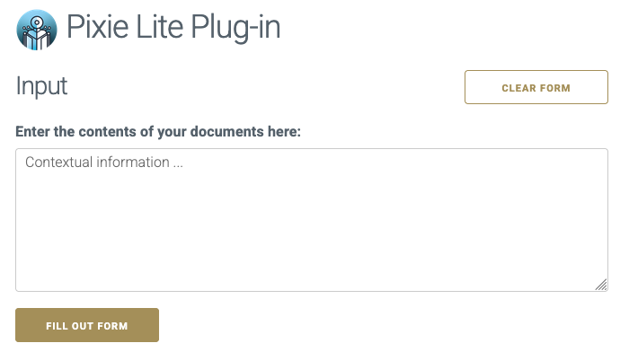

# Firefox LLM Extension

TransformAI

## What's in this repository?

A plug-in extension for Mozilla Firefox to help fill out forms with an LLM.

## Configuration

> In Firefox: Open the `about:debugging` page,  
> click the `This Firefox` option,  
> click the `Load Temporary Add-on` button,  
> then select any file in your extension's directory.

More info on
the [Mozilla webpage](https://developer.mozilla.org/en-US/docs/Mozilla/Add-ons/WebExtensions/Your_first_WebExtension)

## Use

Make sure you enter your OpenRouter key in the appropriate field an click `Save`.

1. Surf to a webpage containing a **form** you wish to fill out.

2. Enter some **background information** you wish to use to autofill the form.  
   (you can paste the contents of entire **documents** in there, up to about ~200 pages of text)

3. Click the button to autofill the form.

## Screenshots

`Menu link`

`Plug-in pop-up`

