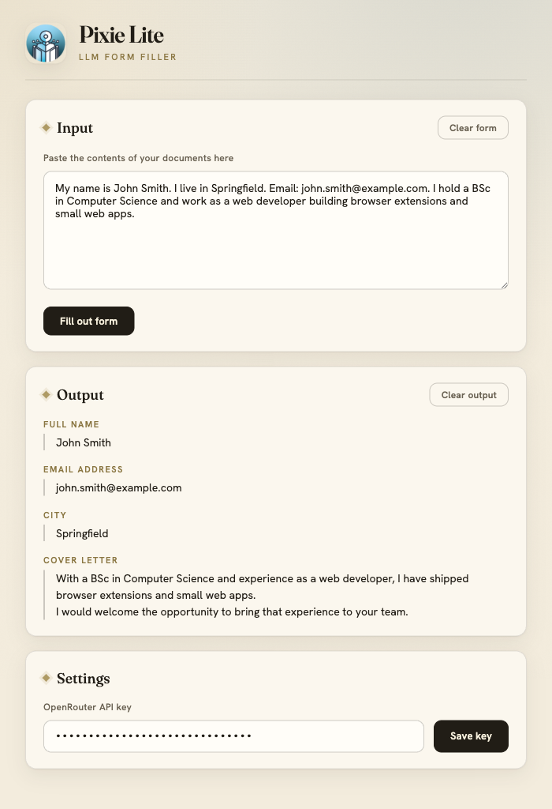

# Pixie Lite

**Pixie Lite** is a Firefox extension that automagically fills out web forms using an LLM.

Paste in some background information (notes, a CV, whole documents), click one
button, and Pixie Lite reads the form on the current page, asks an LLM what
belongs in each field, and fills it in for you.



## How it works

1. The content script scans the active page and builds a compact list of its
   form fields and relevant text, tagging each element with a unique `path`.
2. That structure, plus your background information, is sent to an LLM through
   [OpenRouter](https://openrouter.ai/).
3. The model returns `{path, value, label}` suggestions, which are written back
   into the matching fields and listed in the popup's **Output** panel.

For a deeper dive into the internals, see [CLAUDE.md](CLAUDE.md).

## Built with

- **Vanilla JavaScript** — no framework, no build step or bundler.
- **WebExtensions API (Manifest V3)** — targets Mozilla Firefox.
- **[OpenRouter](https://openrouter.ai/) API** — LLM gateway; default model
  `google/gemini-2.5-flash`.
- **[Vitest](https://vitest.dev/) + [jsdom](https://github.com/jsdom/jsdom)** —
  unit tests for the pure helpers.
- Bundled locally (no third-party requests): the
  [Fraunces](https://fonts.google.com/specimen/Fraunces) and
  [Hanken Grotesk](https://fonts.google.com/specimen/Hanken+Grotesk) fonts and
  `normalize.css`.

## Installation

This is loaded as a temporary add-on (it stays until you restart Firefox).

1. Clone this repository.
2. Open `about:debugging` in Firefox.
3. Click **This Firefox** → **Load Temporary Add-on…**
4. Select the `manifest.json` file in the repository root.

See Mozilla's
[Your first WebExtension](https://developer.mozilla.org/en-US/docs/Mozilla/Add-ons/WebExtensions/Your_first_WebExtension)
guide for more detail.

## Configuration

You need an OpenRouter API key:

1. Create a key at [openrouter.ai](https://openrouter.ai/).
2. Open the Pixie Lite popup, paste the key into **Settings → OpenRouter API
   key**, and click **Save key**.

To use a different model, change `defaultModel` in
[`scripts/llm_tools.js`](scripts/llm_tools.js) to any
[OpenRouter model slug](https://openrouter.ai/models). There is no in-UI model
picker yet.

## Usage

1. Navigate to a web page containing a **form** you want to fill out.
2. Open the Pixie Lite popup and paste your **background information** into the
   Input box (you can paste the contents of entire documents — up to roughly
   200 pages of text).
3. Click **Fill out form**.

Suggestions appear in the **Output** panel and are written into the page. If the
LLM call fails (e.g. an invalid key, or a `4xx`/`5xx` from OpenRouter), the error
is shown in a banner instead of failing silently.

## Development

Running the tests requires **Node.js 20.19+** (or 22.13+, or 24+), per the
Vitest/jsdom toolchain.

```bash
npm install        # first time only
npm test           # run the unit tests once
npm run test:watch # re-run on change
```

The extension itself has no build step — edit a file, then reload the temporary
add-on from `about:debugging`.

## Security & privacy

- When you click **Fill out form**, the current page's form structure **and your
  background information** are sent to OpenRouter (a third party).
- Your API key, background text, and last output are stored **unencrypted** in
  the browser's `localStorage`.
- The extension requests access to the active tab and all sites (`<all_urls>`)
  so it can read and fill forms on the page you are viewing.

Use it only with data and on machines where that is acceptable.

## License

Licensed under the **PolyForm Noncommercial License 1.0.0** — free for
noncommercial use only. See [LICENSE](LICENSE).

Required Notice: Copyright 2026 PXL Smart ICT

Bundled third-party assets (normalize.css, and the Fraunces and Hanken Grotesk
fonts) are under their own licenses — see
[THIRD_PARTY_NOTICES.md](THIRD_PARTY_NOTICES.md).
